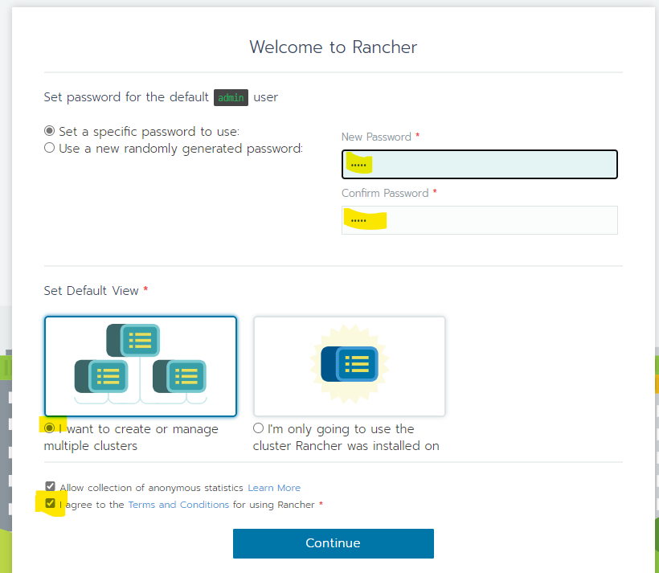
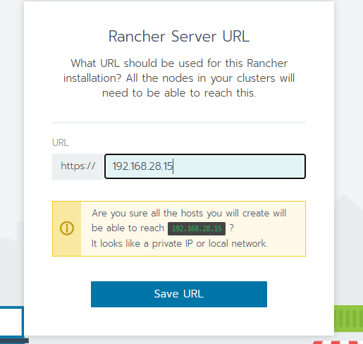
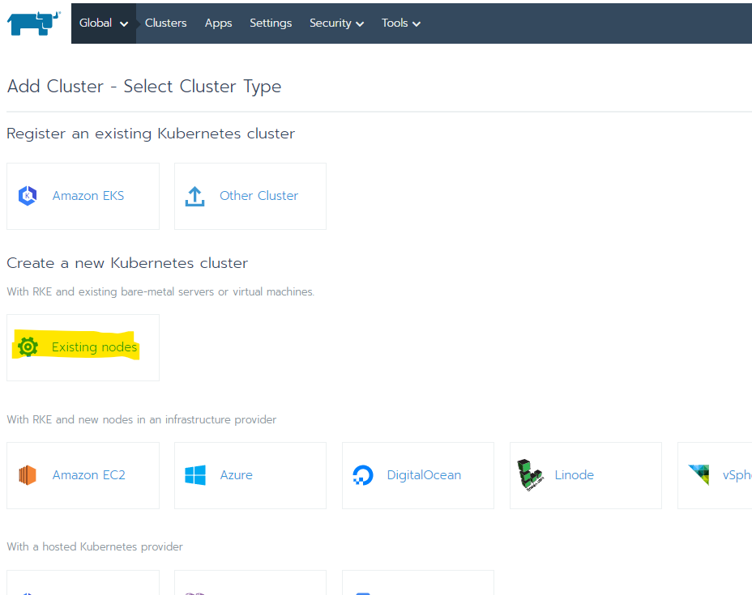
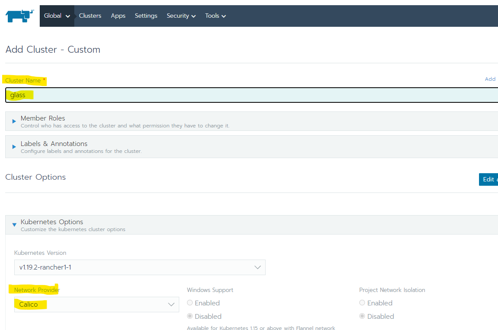
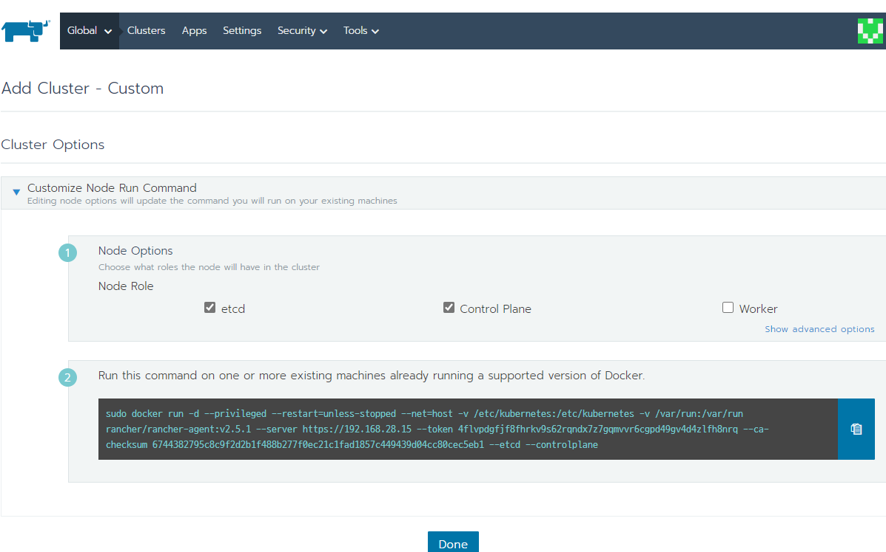
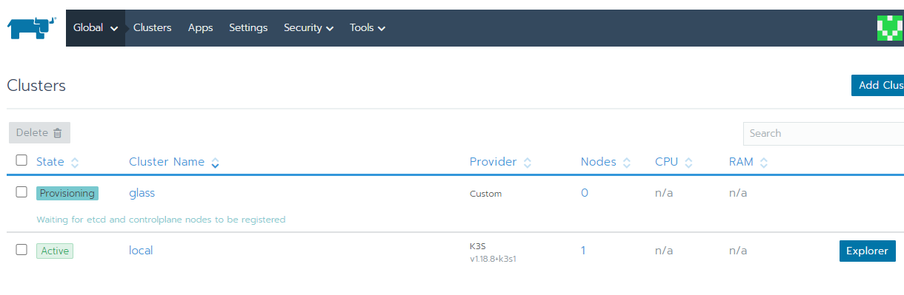
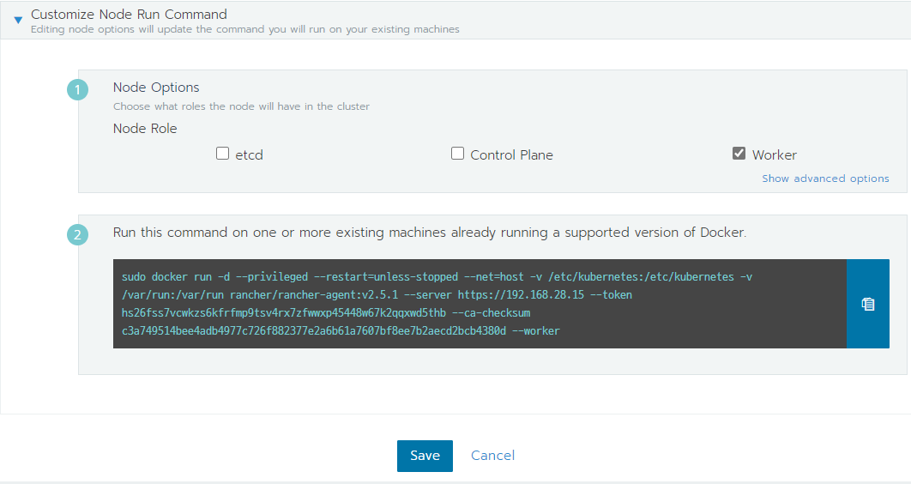
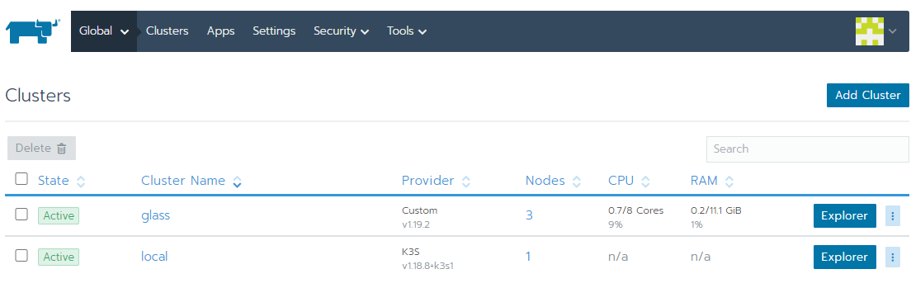
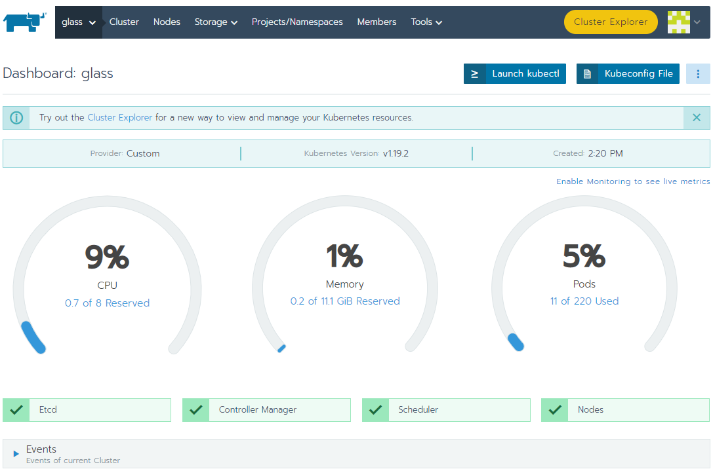
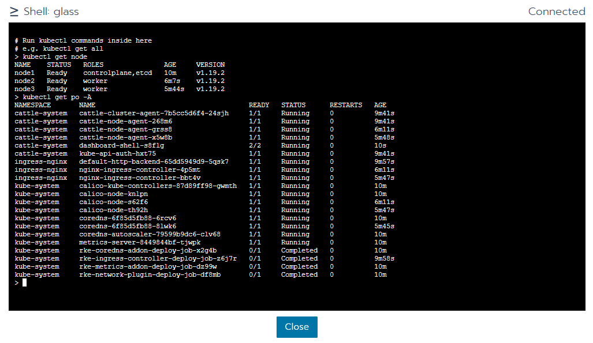

# Rancher Kubernetes 설치 
Docker 및 Kubernetes 클러스터를 포함한 컨테이너를 관리하기 위한 플랫폼

## 설치 
- https://rancher.com/quick-start/

```sh
# 설치를 위한 WEB UI 설치 
$ sudo docker run --privileged -d --restart=unless-stopped -p 80:80 -p 443:443 rancher/rancher
3137e4f80eb95956cc4e1af6b07df9a69e4708c6836aed1a8b3d093c8b190b7d

# 실행 확인
$ docker ps
CONTAINER ID        IMAGE               COMMAND             CREATED             STATUS              PORTS                                      NAMES
3137e4f80eb9        rancher/rancher     "entrypoint.sh"     4 seconds ago       Up 3 seconds        0.0.0.0:80->80/tcp, 0.0.0.0:443->443/tcp   priceless_gates
```

### 설정 
- WEB UI 접속 (https)

#### 패스워드 설정 



#### URL 설정 



#### Add Cluster 선택
- Existing Node 선택 
  - 기 구성된 Kubernetes Cluster 가 있다면 `Other Cluster` 옵션으로 Import 



#### Cluster 세팅 
- Cluster Name 
- Network Provider는 익숙한 Calico 수정 (Option) : Next




### 스크립트 생성 (추출) : Node Run Command 

#### Master Node 
- Master Node Script : etcd [o], Control Plane [o]
- Master Node 에서 실행 



- 진행 이후 Active 변경 됨 


- etcd 오류시 아래 스크립트로 초기화 

```sh
$ rm -rf /var/lib/cni/*
$ rm -rf /var/lib/kubelet/* 
$ rm -rf /etc/cni/* 
$ rm -rf /var/lib/etcd/*
$ rm -rf /etc/kubernetes/*

# 필요하면 Container 및 Volume 삭제 
$ docker rm -f $(docker ps -qa) 
$ docker volume rm -f $(docker volume ls -q)

```

- Kubernetes version unset 오류 
  - Cluster → Edit : Kubernetes Version 확인


#### Worker Node 
- Worker Node Script : Worker [o]
- Worker Node 에서 실행 




### Cluster 확인

#### Cluster 대시보드 



#### Dashboard: glass : `glass` 선택 


#### `Launch kubectl` 



#### CLI 환경을 위한 config 파일 설정 : `Kubeconfig File`
- config 내용중 key의 \ 로 이어진 공백을 모두 제거 후 `~/.kube/config` 복사

```sh
# 오류 
...
   certificate-authority-data: "LS0tLS1CRUdJTiBDRVJUSUZJQ0FURS0tLS0tCk1JSUJpRENDQ\
      VM2Z0F3SUJBZ0lCQURBS0JnZ3Foa2pPUFFRREFqQTdNUnd3R2dZRFZRUUtFeE5rZVc1aGJXbGoKY\
	..."
...


# 정상 
...
   certificate-authority-data: "LS0tLS1CRUdJTiBDRVJUSUZJQ0FURS0tLS0tCk1JSUJpRENDQVM2Z0F3SUJBZ0lCQURBS0JnZ3Foa2pPUFFRREFqQTdNUnd3R2dZRFZRUUtFeE5rZVc1aGJXbGoKY..."
...
```

#### Pods 확인 
- cattle-node-agent : Rancher Agents
- ingress-controller 설치 확인 

```sh
$ kubectl get po -A
NAMESPACE       NAME                                      READY   STATUS      RESTARTS   AGE
cattle-system   cattle-cluster-agent-7b5cc5d6f4-24sjh     1/1     Running     0          17m
cattle-system   cattle-node-agent-268m6                   1/1     Running     0          17m
cattle-system   cattle-node-agent-grss8                   1/1     Running     0          14m
cattle-system   cattle-node-agent-x5w8b                   1/1     Running     0          13m
cattle-system   kube-api-auth-hxt75                       1/1     Running     0          17m
ingress-nginx   default-http-backend-65dd5949d9-5qsk7     1/1     Running     0          17m
ingress-nginx   nginx-ingress-controller-4p5mt            1/1     Running     0          14m
ingress-nginx   nginx-ingress-controller-bbt4v            1/1     Running     0          13m
kube-system     calico-kube-controllers-87d89ff98-gwmth   1/1     Running     0          18m
kube-system     calico-node-knlpn                         1/1     Running     0          18m
kube-system     calico-node-s62f6                         1/1     Running     0          14m
kube-system     calico-node-th92h                         1/1     Running     0          13m
kube-system     coredns-6f85d5fb88-6rcv6                  1/1     Running     0          18m
kube-system     coredns-6f85d5fb88-8lwk6                  1/1     Running     0          13m
kube-system     coredns-autoscaler-79599b9dc6-clv68       1/1     Running     0          18m
kube-system     metrics-server-8449844bf-tjwpk            1/1     Running     0          18m
kube-system     rke-coredns-addon-deploy-job-x2g4b        0/1     Completed   0          18m
kube-system     rke-ingress-controller-deploy-job-z6j7r   0/1     Completed   0          18m
kube-system     rke-metrics-addon-deploy-job-dz99w        0/1     Completed   0          18m
kube-system     rke-network-plugin-deploy-job-df8mb       0/1     Completed   0          18m
```
